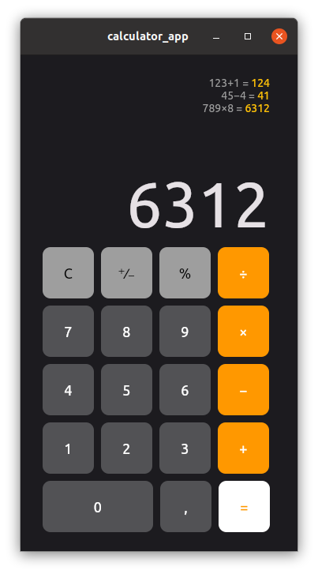

# Calculator - Flutter Mobile App
Simple calculator - inspired from [here](https://shirsh94.medium.com/top-10-flutter-apps-you-must-make-as-a-beginner-351ba913133f)

## Getting Started

Flutter installation (*Your Flutter must be ready*):
1. Clone or download this git repository:
  	  `git clone https://github.com/Progressia/calculator_app.git`
2. Install all packages: 
      `flutter pub get`
3. Run flutter:
      `flutter run`
    
For more instructions go to [documentation](flutter.dev/docs/)
  
  
## Build with
* [Flutter](flutter.dev) - UI framework

## License
GPL-3.0 license